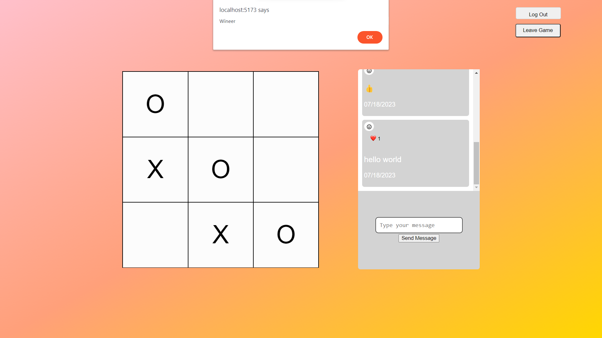
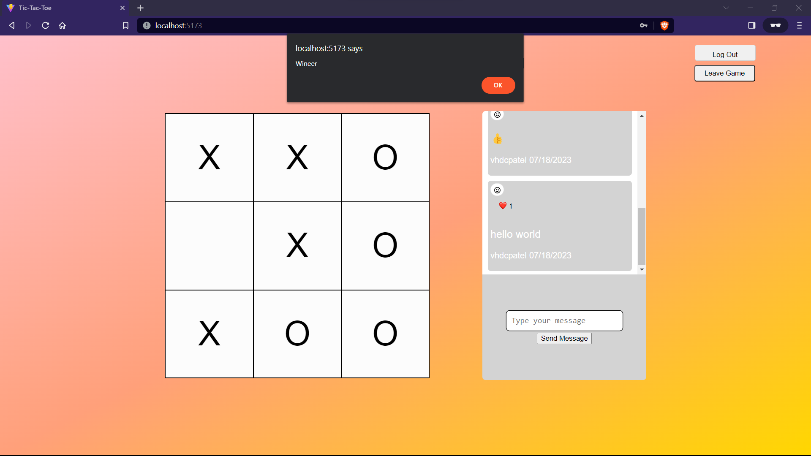

# Multiplayer Tic-Tac-Toe with Stream Chat API

This project is a multiplayer Tic-Tac-Toe game built using React and the Stream Chat API. Players can compete against each other in real-time, making moves on the game board and interacting through chat.

## Features

- Real-time gameplay: Players can make moves on the board, and the game state is updated in real-time for all participants.
- Chat functionality: Users can communicate with each other during the game using the Stream Chat API's real-time chat feature.
- Win/Tie detection: The game detects when a player wins or when the game results in a tie.

## Installation

1. Clone the repository:

```bash
git clone https://github.com/vhdcpatel/multiplayer-tic-tac-toe.git
```

2. Install dependencies

```bash
cd client 
npm install
cd ./ 
cd server 
npm install 
```
3. Set up Stream Chat:

- Sign up for a Stream Chat account at https://getstream.io/chat/.
- Create a new chat application in your Stream Chat dashboard.
- Obtain the API key and secret for your application.
- Set the key in .env file

4. Run client and server
- For Client
```bash
cd client 
npm run server
```
- For server
```bash
cd server 
npm start
```

## Usage

- Open your browser and navigate to http://localhost:5173 and into another browser for the same link.
- Then signup and login into the game.
- Give the user name of the other player and join the game.
- Now enjoy playing and chatting with each other. 

## How to Play
- Players take turns clicking on the empty squares on the game board to make their moves.
- The game will automatically detect when a player wins or when the game results in a tie.
- Players can use the chat feature to communicate with each other during the game.

## Technologies Used
- **React**: Front-end library for building user interfaces.
- **Express**: For Handing backend requests.
- **Stream Chat API**: Real-time chat API for building interactive chat applications.
- **Universal cookie**: For storing user login credentials in the browser session storage.
- **Axios**: To make API requests from the backend. 
- **bcrypt**: To encrypt the user password info.
- **nodemon**: To run the backend server. 
- **dotenv**: To access API key from .env file

## ScreenShots 
- Player O wins the game.
<!--  -->

 

- Tie Game

 

<!--  -->


## Acknowledgments
This project was inspired by the desire to learn and implement real-time features using the Stream Chat API. 
Special thanks to Stream Chat for providing the tools to build engaging chat applications.

## License
This project is licensed under the MIT License.

